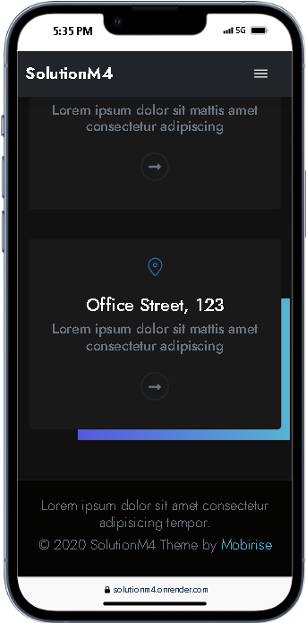
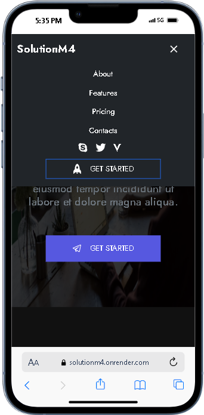
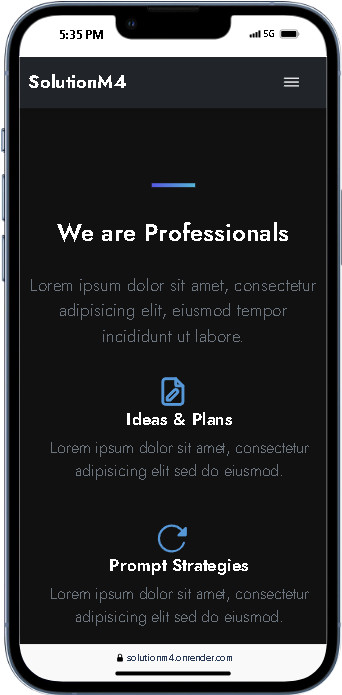
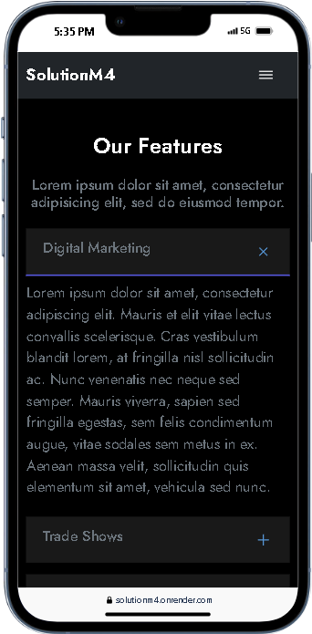
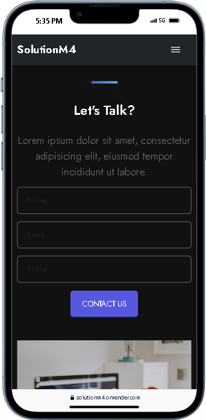
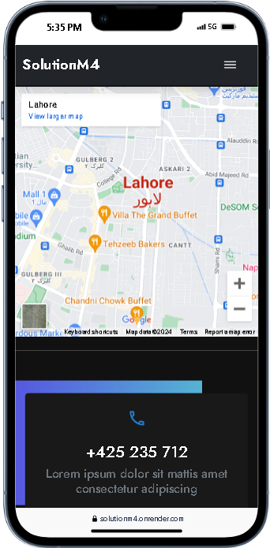

## SolutionM4:

A Robust React.js Template for Streamlined Development

**SolutionM4** empowers you to streamline your React.js web application development with a comprehensive template foundation. This meticulously crafted template offers a clean, modern, and versatile layout that readily adapts to your project's specific requirements.

---

## Demo

## 

## Features

- **Responsive Design:** SolutionM4 is built with responsiveness in mind, ensuring a seamless experience on different devices.

- **Modern Layout:** A clean and modern layout that can be easily customized to suit your project requirements.

- **Flexible Components:** Learn about reusable and flexible React components that enhance code modularity.

- **Styling:** Utilizes CSS for styling, providing a foundation for adding your own design elements.

---

---

## ⚙️ Tech Stack

---

**Project Images**

